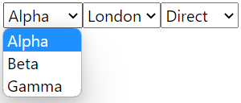
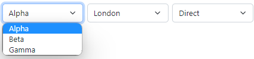
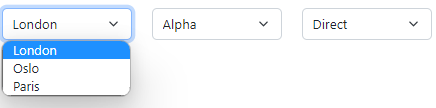
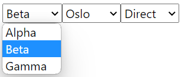
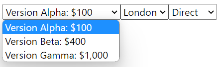
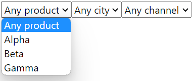

# @gramex/filters

**filters** renders data as filters using `<select>` / `<input>` elements, or frameworks like
[Bootstrap](https://getbootstrap.com/docs/5.2/),
[bootstrap-select](https://developer.snapappointments.com/bootstrap-select/),
etc.

Sample usage:

```js
gramex.filters.render({
  container: "form",
  data: {
    city: [
      { label: "London", value: "LON" },
      { label: "Oslo", value: "OSL" },
      { label: "Paris", value: "PAR" },
    ],
    channel: [
      { label: "Direct", value: "DIR" },
      { label: "Indirect", value: "IND" },
    ],
  },
});
```

## Installation

Run `npm install @gramex/filters`

To use **filters** on the browser, include the script in your HTML:

```html
<script src="https://cdn.jsdelivr.net/npm/@gramex/filters/filters.min.js"></script>
<!-- OR src="node_modules/@gramex/filters/filters.min.js"></script -->
<script>
  gramex.filters.render({...})
</script>
```

For use with ES6 modules, use:

```html
<script type="module">
  import { render } from "node_modules/@gramex/filters/filters.js"
  //  OR { render } from "https://cdn.skypack.dev/@gramex/filters"
  //  OR { render } from "https://esm.sh/@gramex/filters"
  render({...})
</script>
```

## Usage

```html
<form id="basic-usage"></form>
<script type="module">
  import { render } from "node_modules/@gramex/filters/filters.js";
  render({
    container: "form#basic-usage",
    data: {
      product: ["Alpha", "Beta", "Gamma"],
      city: ["London", "Oslo", "Paris"],
      channel: ["Direct", "Indirect"],
    },
  });
</script>
```

This renders:



```html
<form id="basic-usage">
  <select name="product">
    <option value="Alpha">Alpha</option>
    <option value="Beta">Beta</option>
    <option value="Gamma">Gamma</option>
  </select>
  <select name="city">
    <option value="London">London</option>
    <option value="Oslo">Oslo</option>
    <option value="Paris">Paris</option>
  </select>
  <select name="channel">
    <option value="Direct">Direct</option>
    <option value="Indirect">Indirect</option>
  </select>
</form>
```

## Options

- `container`: CSS selector or Element into which filter is rendered
- `type`: type of HTML to generate. Can be
  - `select`: renders `<select>` and `<option>` elements in a HTML form
  - `bs5`: renders [Bootstrap 5 dropdowns](https://getbootstrap.com/docs/5.2/components/dropdowns/)
  - `bootstrap-select`
  - `select2`
  - `selectize`
- `data`: object with filter data. Keys are the filter names. Values are arrays of filter values.
  - Filter values can be a string: `{"choice": ["X", "Y", "Z"]}`
  - Filter values can be an object: `{"choice": [{label: "X", value: "x"}, {label: "Y", value: "y"}]}`
  - Filter names (like `choice`) map to field names (like `<select name="choice">`)
- `url`: a URL that returns the `data` above.
  - At least one of `data` or `url` is required
  - `data` overrides `url`
  - If `url` is used, `gramex.filters.render()` returns a Promise that resolves to the JSON response of `url`
- field: filter-specific field attributes. Keys are the filter names. Values are field attribute scalars or functions
  - `{"city": {"multiple": true}, "product": {"multiple": false}}` makes the `city` filter a multiple-select, but not `product`
  - `{"city": {"class": "form-select"}}` adds a `class="form-select"` to the `city` select
- fields: common field attributes
  - `{"multiple": true}` makes all filters multiple-selects
  - `{"class": "form-select"}` adds a `class="form-select"` to all selects
- value: filter-specific value attributes. Keys are the filter names. Values are value attribute scalars or functions
  - `{"city": {"class": "small"}}` adds `class="small"` to all options in the `city` filter
- values: common value attributes
  - `{"class": "small"}` adds `class="small"` to all options in all filters

Depending on the `type`, field and value attributes are treated specially, as below.

### `type="select"`

<!-- TODO: Document what this does and what the output looks like -->

`field`/`fields` attributes:

- `name`: sets `<select name="${name}">`. E.g. `name: "city"`
- `value`: currently selected value. Sets `selected` attribute on matching items. E.g. `value: "LON"`
- `label`: sets `<label>${label} ...</label>`. E.g. `label: "City"`
- `default`: a `value` object to use as default, if it's missing in `values`.
  E.g. `default: "-"` or `default: {label: "All", value: ""}`
- `multiple: true`: sets `multiple` on `<select>`. E.g. `multiple: true`
- `values`: list of values to render as options. Defaults to `data[name]`
- `selector`: renders existing `<select>` elements if found.
  E.g. `selector: "select[data-name="${name}]"` renders matching `<select data-name="...">`
  if they exist, else creates new ones
- `render`: `function({name, values, ...})` that returns HTML to render if no`<select>`is found.
  Defaults roughly to `` ({label, name}) => `<label>${label} <select name="${name}"></select></label>`; ``
- `update`: `function({el, name, values, ...})` called after rendering HTML. Used to bind event handlers

`value`/`values` attributes:

- `value`: sets `<option value="${value}">`
- `label`: sets `<option>${label}</option>`. Defaults to `value`
- `render`: function to render HTML if no `<option>` is found. Defaults roughly to `` ({label, value}) => `<option value="${value}">${label}</option>`; ``

To render your own field, use:

```html
<select name="${name}"></select>
```

To render your own value, use:

```html
<option ${value == fieldData?.value ? "selected" : ""} value="${value}">${label}</option>
```

### `type="bs5"`

<!-- TODO: Document what this does and what the output looks like -->

`field`/`fields` attributes:

- `name`: sets `<div class="dropdown ${name}">`. E.g. `name: "city"`
- `value`: currently selected value. Sets `class="active"` on matching items. E.g. `value: "LON"`
- `label`: sets `<button>${label}</button>`. Defaults to `name`. E.g. `label: "City"`
- `multiple`: TODO: not implemented yet
- `default`: a `value` object to use as default, if it's missing in `values`
  E.g. `default: "-"` or `default: {label: "All", value: ""}`
- `buttonClass`: sets `<button class="dropdown-toggle ${buttonClass}">`
- `dropdownClass`: sets `<div class="dropdown ${dropdownClass}">`
- `menuClass`: sets `<ul class="dropdown-menu ${menuClass}"></ul>`
- `values`: list of values to render as options. Defaults to `data[name]`
- `selector`: renders existing `.dropdown` elements with an ID/class matching `name`, if they have a `.dropdown-menu` child. See example below.
- `render`: `function({name, values, ...})` that returns HTML to render if no `.dropdown` is found
- `update`: `function({el, name, values, ...})` called after rendering HTML. Used to bind event handlers

`value`/`values` attributes:

- `value`: sets `active` class on `.dropdown-item` if `value` matches the current value
- `label`: sets `<li><a class="dropdown-item"}>${label}</a></li>`. Defaults to `value`
- `render`: function to render HTML if no `<option>` is found. Defaults roughly to `({label}) => <li><a class="dropdown-item">${label}</a></li>`

To render your own field, use:

```html
<div class="dropdown ${name} ${dropdownClass}">
  <button class="dropdown-toggle ${btnClass}" type="button" data-bs-toggle="dropdown">${label}</button>
  <ul class="dropdown-menu ${menuClass}"></ul>
</div>
```

To render your own value, use:

```html
<li><a class="dropdown-item ${dropdownItemClass} ${value == fieldData?.value ? 'active' : ''}">${label}</a></li>
```

## Examples

### Fetch data from URL

This loads data from `data-sales.json` and renders it as filters into the `<form>`.

```html
<form></form>
<script type="module">
  import { render } from "node_modules/@gramex/filters/filters.js";
  render({
    container: "form",
    url: "data-sales.json",
  });
</script>
```

Sample `data-sales.json`:

```json
{
  "product": ["Alpha", "Beta", "Gamma"],
  "city": ["London", "Oslo", "Paris"],
  "channel": ["Direct", "Indirect"]
}
```

This renders:


### Add classes to field

Add `fields.class` to specify classes for all fields:

```html
<link
  href="https://cdn.jsdelivr.net/npm/bootstrap@5/dist/css/bootstrap.min.css"
  rel="stylesheet"
/>
<form class="d-flex"></form>
<script type="module">
  import { render } from "node_modules/@gramex/filters/filters.js";
  render({
    container: "form",
    url: "data-sales.json",
    fields: { class: "form-select me-2" },
  });
</script>
```

This renders:



### Use existing HTML

To apply the filters to existing (styled) HTML, the `<select>` elements should have a `name=`,
`class=` or `id=` that matches the field name.

```html
<link
  href="https://cdn.jsdelivr.net/npm/bootstrap@5/dist/css/bootstrap.min.css"
  rel="stylesheet"
/>
<form class="row">
  <div class="col"><select name="city" class="form-select"></select></div>
  <div class="col"><select name="product" class="form-select"></select></div>
  <div class="col"><select name="channel" class="form-select"></select></div>
</form>
<script type="module">
  import { render } from "node_modules/@gramex/filters/filters.js";
  render({
    container: "form",
    url: "data-sales.json",
  });
</script>
```

This re-uses the existing `<select>` elements in the same order and style as in the HTML:



### Set selected values

Add `fields.value` to set selected values:

```html
<form class="d-flex"></form>
<script type="module">
  import { render } from "node_modules/@gramex/filters/filters.js";
  render({
    container: "form",
    url: "data-sales.json",
    fields: { value: { product: "Beta", city: "Oslo", channel: "Direct" } },
  });
</script>
```

This renders:



### Set custom labels

Add `value.[name].label` to set custom labels:

```html
<form></form>
<script type="module">
  import { render } from "node_modules/@gramex/filters/filters.js";
  const productDetails = {
    Alpha: "Version Alpha: $100",
    Beta: "Version Beta: $400",
    Gamma: "Version Gamma: $1,000",
  };
  render({
    container: "form",
    url: "data-sales.json",
    value: {
      product: { label: ({ value }) => productDetails[value] },
    },
  });
</script>
```

This renders:



### Add default value

Add `fields.default.[name]` to add a default value:

```html
<form></form>
<script type="module">
  import { render } from "node_modules/@gramex/filters/filters.js";
  render({
    container: "form",
    url: "data-sales.json",
    fields: {
      default: {
        product: { label: "Any product", value: "" },
        city: { label: "Any city", value: "" },
        channel: { label: "Any channel", value: "" },
      },
    },
  });
</script>
```

This renders:



<!--

```bash
# Run manual tests
npx serve &
npm run watch &
# Visit http://localhost:3000/tests/select.test.html

# Run tests. If puppeteer "Could not find Chromium", run "npm ci"
npm test

# Publish
npm publish
```
-->
